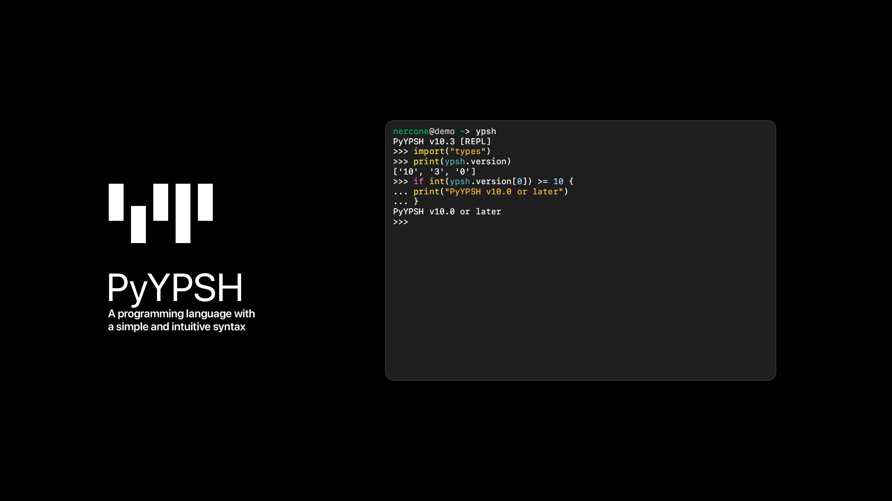

> [!IMPORTANT]
> I am developing various projects, and since I manage, maintain, and update all of them myself, there may be times when I can't attend to each project individually.
> For example, large-scale projects like [Zeta-LLM](https://github.com/Zeta-DGC/Zeta-LLM) are very difficult to develop.
> [PyYPSH](https://github.com/YPSH-DGC/YPSH) is also a challenging project, as it implements a custom programming language using ASTs, which is quite advanced.
> If you would like to report bugs or suggest new features for my projects, I would greatly appreciate it if you could use pull requests and make them ready to merge, if possible.
> Also, if someone else has already created an issue, I would be thankful if you could create a pull request that immediately addresses the problem, if you're able to.
> (This message is displayed in some repositories created by Nercone. Translated by GPT-4o.)

---

**YPSH - Your route of Programming is Starting from Here**

PyYPSH is one of the official implementations of the YPSH programming language.

It is being developed by DiamondGotCat (hereafter referred to as the creator) alone and is available on GitHub under the MIT license.

## About the YPSH Language
The creation of the YPSH language was prompted by a problem the creator was struggling with.

The creator, who uses Python, Swift, PHP, etc. (primarily Python), noticed that certain language-specific issues, such as Python's indentation and PHP's `;`, were inherently inconvenient, leading him to wonder, "Isn't it possible to combine the best parts of various languages?"

This is why PyYPSH has such strong integration with the Python interpreter.
Python has a large number of libraries, so it's only natural that you'd want to use them in your own language.

The PyYPSH interpreter offers features that are only possible because it's based on Python, such as direct import of Python libraries.

## Requirements
- CPython (Behavior on other Python implementations has not been tested)
- rich, python‑dotenv (for PyYPSH Runtime, Required)
- psutil, prompt_toolkit (for PyYPSH Runtime, Optional)
- requests (for PyYPSH Setup, Required)
- pyside6 (for PyYPSH Setup, Optional)
- pip/uv, rich, zstandard (for PyNABS, Required)
- ulid-py (for PyYPSH Configurator, Required)

**Supported Python Versions:**
|       | Status      | Reason                                                                                                    |
| ----- | ----------- | --------------------------------------------------------------------------------------------------------- |
| 3.6   | Not Working | `from __future__ import annotations` and `subprocess.run`'s `text` and `capture_output` needs Python 3.7+ |
| 3.7   | Not Working | `from typing import ... Literal` needs Python 3.8+                                                        |
| 3.8   | Not Working | `python-dotenv` needs 3.9+                                                                                |
| 3.9   | Working     | All features are working                                                                                  |
| 3.10  | Recommended | Same as above                                                                                             |
| 3.11  | Recommended | Same as above                                                                                             |
| 3.12  | Recommended | Same as above                                                                                             |
| 3.13  | Working     | Same as above                                                                                             |
| 3.14  | Working     | Same as above                                                                                             |
| 3.15+ | Maybe       | I don't know yet as 3.15 has not been released, but it might work.                                        |

**Note:** This is the result of an investigation into the Python features used internally by the PyYPSH runtime and the main external libraries required for the runtime to function. It does not reflect the support status of some Python integration features or other libraries. The investigation was conducted by AI, so some information may be incorrect.

## About Windows 11
Windows 11 has recently caused many issues, and I do not believe that PyYPSH will continue to function properly.
It might work, but I will not address any issues that arise on Windows 11 in the future.

## Building PyYPSH

### NABS (Nercone Automatic Building System)

### Pre-built Executables
PyYPSH uses GitHub Actions to automatically run NABS after each release. 
Thanks to this, in most environments you won't need to build it manually. However, in some environments, certain features may not function properly. 
If you want to ensure everything works reliably, please refer to the "Manual Building on Your Env" section and build it in the environment where you plan to use it—or in an identical environment. 
The pre-built executables can be downloaded from [GitHub's Release tab](https://github.com/YPSH-DGC/YPSH/releases) or from the [Download the PyYPSH](https://ypsh.diamondgotcat.net/download) page.

**Build status of the pre-built executables:**

You can see the pre-build status of PyYPSH Runtime [here](https://github.com/YPSH-DGC/YPSH/actions/workflows/build-runtime.yml), and PyYPSH Setup [here](https://github.com/YPSH-DGC/YPSH/actions/workflows/build-setup.yml).

**Verification results of the pre-built executables:**
|             |         |         | macOS             | Windows           | Linux          | 
| ----------- | ------- | ------- | ----------------- | ----------------- | -------------- | 
| PyInstaller | Runtime | x86_64  | Not Tested        | Works properly    | Works properly | 
|             |         | aarch64 | Works properly    | Not Tested        | Not Tested     | 
|             | Setup   | x86_64  | Not Tested        | Works properly    | Works properly | 
|             |         | aarch64 | Works properly    | Not Tested        | Not Tested     | 
| Nuitka      | Runtime | x86_64  | Not Tested        | Works properly    | Works properly | 
|             |         | aarch64 | Works properly    | Not Tested        | Not Tested     | 
|             | Setup   | x86_64  | Not Tested        | GUI does not work | Not tested     | 
|             |         | aarch64 | GUI does not work | Not Tested        | Not tested     | 

### Building on Your Env
If you want to run and build NABS locally, follow these steps:
1. Install Python. (See *Supported Python Versions* Section to Check supported Python's version.)
2. Create and activate a Python virtual environment (using pyenv, venv, uv, anaconda, miniconda, etc.). Since NABS installs dependencies automatically, do this if you want to build in a different environment.
3. Prepare a configuration file (used by the configurator.py` to configure PyYPSH). If not provided, defaults will be applied.
4. Install `rich` and `ulid-py` (using pip, uv, or any other package manager that supports PyPI).
5. Run the `configurator.py`. (You can specify the config file using the `-c` option.)
6. Download `pynabs.py` from `https://raw.githubusercontent.com/DiamondGotCat/NABS/refs/heads/main/pynabs.py`
7. Run `pynabs.py` (with `-m pyinstaller` or `-m nuitka`). (You can set the output filepath using the `-o` option.)

### PyInstaller vs Nuitka
Both PyInstaller and Nuitka are tools for distributing Python scripts as executable files, but they work in completely different ways.
PyInstaller bundles Python scripts with the Python interpreter and all required modules into a single executable, ensuring full compatibility.
Nuitka translates Python code into C code that uses the CPython C API to execute Python semantics at the C level.
Nuitka supports almost all Python syntax and standard libraries, though a few highly dynamic features may have limited support.
Because Nuitka compiles Python code into C and then into machine code, it can run faster than PyInstaller-based executables.
If compatibility is important, use PyInstaller; if speed is important, use Nuitka.

### DGC-AutoBuild
Previously, Used "DGC-AutoBuild," an automated build system that utilizes GitHub Actions.

**Versions:**
- **V1:** 1st version, PyInstaller, 3 platforms
- **V2:** 2nd version, Nuitka, 4 platforms
- **V3:** 3rd version, Nuitka, 6 platforms
- **V4 (Last):** 4th version, PyInstaller, 6 platforms
- **V4.5:** 5th version, PyInstaller, 6 platforms, 1 experimental platforms (Reverted to V4 partway through)

## Contributions
YPSH is under active development on GitHub.

If you need a feature or fix, please open an issue or make your own changes and submit a pull request.

Your contributions are welcome.

---

  

#### Translated by LLM/Translation Services
Some texts have been translated from ja-JP using LLM or translation services.
